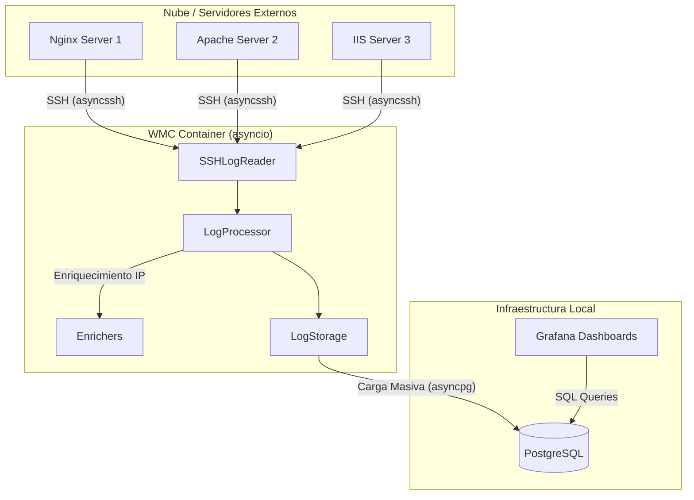

# 🏗️ Web Metrics Collector: Arquitectura del Sistema

Esta documentación proporciona una visión técnica detallada del **Web Metrics Collector (WMC)**, diseñada para desarrolladores que deseen entender, mantener o extender el sistema.

---

## 📋 Tabla de Contenidos
1. [Arquitectura](#arquitectura)
2. [Flujo de Datos](#flujo-de-datos)
3. [Componentes del Core](#componentes-del-core)
4. [API REST & Acceso a Datos](#api-rest)
5. [Base de Datos](#base-de-datos)
6. [Funcionalidades del Frontend](#funcionalidades-del-frontend)
7. [Desarrollo y Pruebas](#desarrollo)
8. [Tech Stack](#tech-stack)

---

## 1. Arquitectura <a name="arquitectura"></a>

WMC utiliza una arquitectura **basada en eventos y asíncrona** implementada con `asyncio`. A diferencia de las versiones anteriores basadas en hilos (threads), el sistema actual utiliza un único bucle de eventos para gestionar cientos de conexiones concurrentes de forma eficiente.

### Diagrama de Bloques


---

## 2. Flujo de Datos <a name="flujo-de-datos"></a>

1.  **Colección**: El `SSHLogReader` se conecta concurrentemente a todos los hosts definidos en `hosts.yml` usando `asyncssh`.
2.  **Lectura Delta**: El sistema solo lee los bytes nuevos (delta) de cada archivo de log para minimizar el tráfico de red.
3.  **Parsing**: Se detecta el formato (JSON, CLF o W3C) y se extraen los campos relevantes.
4.  **Enriquecimiento**:
    - **GeoIP**: Localización geográfica (País, Ciudad, Lat/Lon).
    - **Reverse DNS**: Resolución de IP a Hostname con caché asíncrona.
    - **UserAgent**: Clasificación de Navegador, OS y clasificación de Bots (Good vs Bad).
5.  **Almacenamiento**: Los logs se agrupan y se insertan en PostgreSQL utilizando `executemany` para máxima velocidad.

---

## 3. Componentes del Core <a name="componentes-del-core"></a>

- **`main.py`**: El punto de entrada. Gestiona el bucle `asyncio`, las señales de parada y el scheduler de retención de datos.
- **`processor.py`**: El cerebro del sistema. Orquestra la lectura, el parsing y el guardado.
- **`ssh_client.py`**: Gestiona túneles SSH asíncronos persistentes.
- **`storage.py`**: Maneja el pool de conexiones a PostgreSQL (vía `asyncpg`).
- **`verifier.py`**: Lógica de seguridad para detectar "Fake Googlebots" mediante Reverse DNS.

---

## 4. API REST & Acceso a Datos <a name="api-rest"></a>

Actualmente, **WMC no expone una API REST interna**. El acceso a los datos se realiza de forma directa y desacoplada:

1.  **Ingesta**: El Collector escribe directamente en la tabla `web_access_logs`.
2.  **Visualización**: Grafana consulta la base de datos mediante SQL estándar.
3.  **Extensibilidad**: Si necesitas exponer datos a otros sistemas, se recomienda crear vistas en PostgreSQL o conectar herramientas de BI directamente a la base de datos.

---

## 5. Base de Datos <a name="base-de-datos"></a>

### Esquema Principal: `web_access_logs`
| Campo | Tipo | Descripción |
| :--- | :--- | :--- |
| `id` | UUID | Identificador único. |
| `timestamp` | TIMESTAMPTZ | Fecha de la petición (parseada del log). |
| `source_host` | VARCHAR | Nombre del servidor origen. |
| `client_ip` | INET | Dirección IP del cliente. |
| `hostname` | VARCHAR | Reverse DNS del cliente. |
| `status_code` | SMALLINT | Código HTTP (200, 404, etc). |
| `bot_category`| VARCHAR | Clasificación (GoodBot, BadBot, etc). |

### Vistas Optimizadas
- `view_requests_per_minute`: Para gráficos de tráfico en tiempo real.
- `view_status_codes_summary`: Para alertas de errores HTTP.

---

## 6. Funcionalidades del Frontend <a name="funcionalidades-del-frontend"></a>

El "Frontend" está compuesto por dashboards de Grafana dinámicos:

- **Mapa 3D Real-time**: Visualiza el origen geográfico de los hits.
- **Detección de Clones (Suspicious Hosts)**: Filtra tráfico que no coincide con tu dominio configurado.
- **Panel de Latencia**: Monitoriza el rendimiento de tus sitios (solo para logs Nginx JSON).
- **Control de Retención**: Gestión automática para eliminar datos antiguos sin intervención manual.

---

## 7. Desarrollo y Pruebas <a name="desarrollo"></a>

### Entorno Local
Se recomienda usar Docker Compose para levantar el stack completo:
```bash
docker compose up -d --build
```

### Ejecutar Pruebas
WMC utiliza `pytest` con el plugin `pytest-asyncio`:
```bash
# Dentro del contenedor
pytest tests/
```

### Mocking
El sistema incluye mocks para SSH y Base de Datos en `tests/test_async.py`, permitiendo probar la lógica sin necesidad de infraestructura real.

---

## 8. Tech Stack <a name="tech-stack"></a>

- **Lenguaje**: Python 3.12 (Asíncrono)
- **Engine**: `asyncio`
- **Networking**: `asyncssh`
- **Database**: PostgreSQL 16 + `asyncpg`
- **Geolocalización**: MaxMind GeoLite2
- **Visualización**: Grafana 12.0
- **Containerización**: Docker (Multi-stage Build)
- **Formatos Soportados**: Nginx (JSON/CLF), Apache (Combined), IIS (W3C), **Traefik (JSON)**, **Caddy (JSON)**, **HAProxy**.

---

