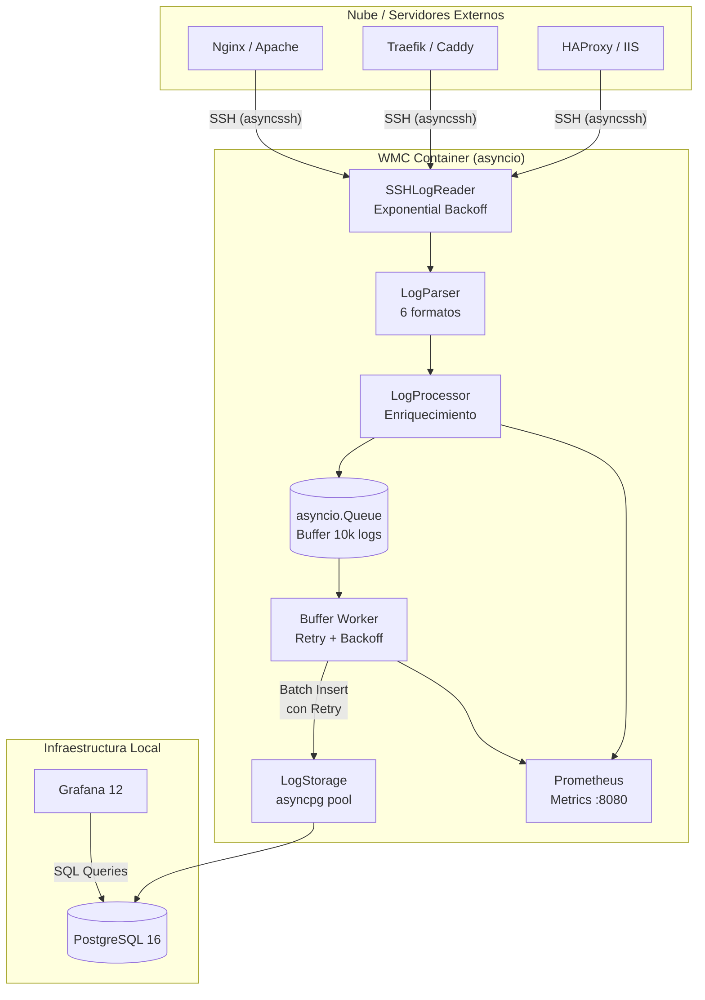

# 🏗️ Web Metrics Collector: Arquitectura del Sistema

Esta documentación proporciona una visión técnica detallada del **Web Metrics Collector (WMC)**, diseñada para desarrolladores que deseen entender, mantener o extender el sistema.

---

## 📋 Tabla de Contenidos
1. [Arquitectura](#arquitectura)
2. [Flujo de Datos](#flujo-de-datos)
3. [Resiliencia y Auto-Recuperación](#resiliencia)
4. [Observabilidad](#observabilidad)
5. [Componentes del Core](#componentes-del-core)
6. [Base de Datos](#base-de-datos)
7. [Desarrollo y Pruebas](#desarrollo)
8. [Tech Stack](#tech-stack)

---

## 1. Arquitectura <a name="arquitectura"></a>

WMC utiliza una arquitectura **basada en eventos y asíncrona** implementada con `asyncio`. Un único bucle de eventos gestiona cientos de conexiones concurrentes de forma eficiente. La ingesta de logs está **desacoplada** del almacenamiento mediante una cola en memoria (`asyncio.Queue`), lo que garantiza que los logs no se pierdan durante fallos temporales de la base de datos.

### Diagrama de Bloques


---

## 2. Flujo de Datos <a name="flujo-de-datos"></a>

1.  **Colección**: El `SSHLogReader` se conecta concurrentemente a todos los hosts definidos en `hosts.yml` usando `asyncssh`. Si la conexión falla, reintenta con **Exponential Backoff** (hasta 5 intentos, delay inicial 1s).
2.  **Lectura Delta**: El sistema solo lee los bytes nuevos (delta) de cada archivo de log para minimizar el tráfico de red.
3.  **Parsing**: Se detecta el formato del log y se extraen los campos relevantes. Formatos soportados:
    - **Nginx** (JSON y Combined Log Format)
    - **Apache** (Combined Log Format)
    - **IIS** (W3C)
    - **Traefik** (JSON)
    - **Caddy** (JSON)
    - **HAProxy** (HTTP Log Format)
4.  **Enriquecimiento**:
    - **GeoIP**: Localización geográfica (País, Ciudad, Lat/Lon).
    - **Reverse DNS**: Resolución de IP a Hostname con caché asíncrona.
    - **UserAgent**: Clasificación de Navegador, OS y Bots (Good vs Bad).
5.  **Buffering**: Los logs enriquecidos se depositan en una `asyncio.Queue` (capacidad: 10.000 entradas). Esto desacopla la ingesta del almacenamiento.
6.  **Almacenamiento**: Un worker en background consume la cola en lotes de hasta 500 logs y los inserta en PostgreSQL. Si la DB falla, reintenta con **Exponential Backoff** (hasta 5 intentos).

---

## 3. Resiliencia y Auto-Recuperación <a name="resiliencia"></a>

### Exponential Backoff en SSH (`ssh_client.py`)
Si un servidor remoto no responde, el `SSHLogReader` no falla inmediatamente. Reintenta la conexión con esperas crecientes:

| Intento | Espera |
| :---: | :---: |
| 1 | 1s |
| 2 | 2s |
| 3 | 4s |
| 4 | 8s |
| 5 | 16s |

### Buffer en Memoria (`processor.py`)
El `LogProcessor` utiliza un `asyncio.Queue` como buffer entre la ingesta y el almacenamiento:
- **Capacidad**: 10.000 logs en memoria.
- **Comportamiento ante fallo de DB**: Los logs permanecen en la cola y se reintentan automáticamente cuando la DB vuelve a estar disponible.
- **Comportamiento ante buffer lleno**: Se registra un error y el log se descarta (evita OOM).

### Retry en Almacenamiento (`processor.py`)
El worker de background aplica Exponential Backoff al guardar en PostgreSQL:
- **Máx. reintentos**: 5
- **Delay inicial**: 1s (se dobla en cada intento)

---

## 4. Observabilidad <a name="observabilidad"></a>

### Métricas Prometheus (`:8080/metrics`)
El servidor de métricas se inicia automáticamente al arrancar el contenedor. Puedes consultar las métricas con:
```bash
curl http://localhost:8080/metrics
```

| Métrica | Tipo | Descripción |
| :--- | :--- | :--- |
| `wmc_logs_processed_total` | Counter | Logs procesados, etiquetados por `source_host` y `status` (`success`, `parse_error`, `buffer_full`). |
| `wmc_log_buffer_size` | Gauge | Logs actualmente en la cola de memoria. |
| `wmc_log_batches_saved_total` | Counter | Lotes guardados exitosamente en la DB. |
| `wmc_db_save_errors_total` | Counter | Errores al guardar en la DB (tras agotar reintentos). |
| `wmc_ssh_connection_attempts_total` | Counter | Intentos de conexión SSH, etiquetados por `host` y `result` (`success`, `failure`). |
| `wmc_ingestion_latency_seconds` | Histogram | Tiempo de procesamiento y enriquecimiento por línea de log. |

### Docker Health Check (`Dockerfile`)
El contenedor incluye un `HEALTHCHECK` nativo que consulta el endpoint de métricas cada 30 segundos. Si el servidor de métricas no responde (lo que indica que el event loop está bloqueado), Docker marcará el contenedor como `unhealthy` y puede reiniciarlo automáticamente.

```dockerfile
HEALTHCHECK --interval=30s --timeout=10s --start-period=5s --retries=3 \
    CMD python healthcheck.py
```

---

## 5. Componentes del Core <a name="componentes-del-core"></a>

| Archivo | Responsabilidad |
| :--- | :--- |
| `main.py` | Punto de entrada. Gestiona el event loop, señales de parada, el scheduler de retención y arranca el servidor Prometheus. |
| `processor.py` | Cerebro del sistema. Orquesta la lectura, el parsing, el enriquecimiento y el buffering. Contiene el worker de background. |
| `ssh_client.py` | Gestiona túneles SSH asíncronos persistentes con Exponential Backoff. |
| `parser.py` | Parsea líneas de log en 6 formatos distintos. |
| `storage.py` | Maneja el pool de conexiones a PostgreSQL vía `asyncpg`. |
| `metrics.py` | Define todos los contadores y gauges de Prometheus. |
| `healthcheck.py` | Script de health check consultado por Docker. |
| `geoip.py` | Enriquecimiento GeoIP con MaxMind GeoLite2. |
| `dns_enricher.py` | Resolución DNS inversa asíncrona con caché. |
| `ua_enricher.py` | Parsing y clasificación de User-Agent strings. |
| `verifier.py` | Detección de Fake Googlebots mediante Reverse DNS. |
| `config.py` | Carga de configuración desde `hosts.yml` y variables de entorno. |

---

## 6. Funcionalidades del Frontend <a name="funcionalidades-del-frontend"></a>

El "Frontend" está compuesto por dos dashboards de Grafana preconfigurados:

### 📊 WMC Dashboard (Principal)
- **Mapa 3D Real-time**: Visualiza el origen geográfico de los hits.
- **Detección de Clones (Suspicious Hosts)**: Filtra tráfico que no coincide con tu dominio configurado.
- **Panel de Latencia**: Monitoriza el rendimiento de tus sitios (solo para logs Nginx JSON).
- **Control de Retención**: Gestión automática para eliminar datos antiguos sin intervención manual.

### 🛡️ WMC Security Center (Dashboard V2)
Centro de mando de seguridad con analítica premium:
- **Mapa de Ataques**: Mapa mundial interactivo con burbujas escaladas por volumen de peticiones bloqueadas (bots maliciosos, fake Googlebots, errores 4xx).
- **Top 10 IPs Amenaza**: Tabla con IP, país, ciudad, total de peticiones, % de errores, detección de Fake Bot y categoría.
- **Ataques por País**: Donut chart con distribución geográfica de los ataques.
- **Ancho de Banda Bots vs Usuarios**: Serie temporal comparando bytes consumidos por bots vs usuarios reales.
- **KPIs de Seguridad**: Paneles de bytes a bots, bytes a usuarios reales, % de ancho de banda consumido por bots (gauge con umbrales de alerta) y total de peticiones bloqueadas.

---

## 7. Base de Datos <a name="base-de-datos"></a>

### Esquema Principal: `web_access_logs`
| Campo | Tipo | Descripción |
| :--- | :--- | :--- |
| `id` | UUID | Identificador único. |
| `timestamp` | TIMESTAMPTZ | Fecha de la petición (parseada del log). |
| `source_host` | VARCHAR | Nombre del servidor origen. |
| `client_ip` | INET | Dirección IP del cliente. |
| `hostname` | VARCHAR | Reverse DNS del cliente. |
| `method` | VARCHAR | Método HTTP (GET, POST, etc). |
| `uri` | TEXT | URI solicitada. |
| `status_code` | SMALLINT | Código HTTP (200, 404, etc). |
| `response_size` | INTEGER | Tamaño de la respuesta en bytes. |
| `request_time_ms` | FLOAT | Latencia de la petición en ms. |
| `country_code` | CHAR(2) | Código de país ISO. |
| `city` | VARCHAR | Ciudad del cliente. |
| `latitude` | FLOAT | Latitud geográfica. |
| `longitude` | FLOAT | Longitud geográfica. |
| `user_agent` | TEXT | User-Agent string completo. |
| `bot_category` | VARCHAR | Clasificación (GoodBot, BadBot, etc). |
| `is_fake_bot` | BOOLEAN | `true` si se detectó como Fake Googlebot. |

### Vistas Optimizadas
- `view_requests_per_minute`: Para gráficos de tráfico en tiempo real.
- `view_status_codes_summary`: Para alertas de errores HTTP.

---

## 7. Desarrollo y Pruebas <a name="desarrollo"></a>

### Entorno Local
```bash
docker compose up -d --build
```

### Ejecutar Pruebas
```bash
docker compose run --rm log-processor pytest tests/
```

### Verificar Métricas
```bash
curl http://localhost:8080/metrics | grep wmc_
```

---

## 8. Tech Stack <a name="tech-stack"></a>

| Categoría | Tecnología |
| :--- | :--- |
| **Lenguaje** | Python 3.12 (Asíncrono) |
| **Engine** | `asyncio` |
| **Networking** | `asyncssh` |
| **Database** | PostgreSQL 16 + `asyncpg` |
| **Geolocalización** | MaxMind GeoLite2 |
| **Visualización** | Grafana 12.0 |
| **Containerización** | Docker (Multi-stage Build, non-root user) |
| **Observabilidad** | `prometheus_client` (`:8080/metrics`) |
| **Parsers** | Nginx (JSON/CLF), Apache, IIS (W3C), Traefik, Caddy, HAProxy |
| **Resiliencia** | Exponential Backoff (SSH + DB) + `asyncio.Queue` buffer |
| **Testing** | `pytest` + `pytest-asyncio` |

---
