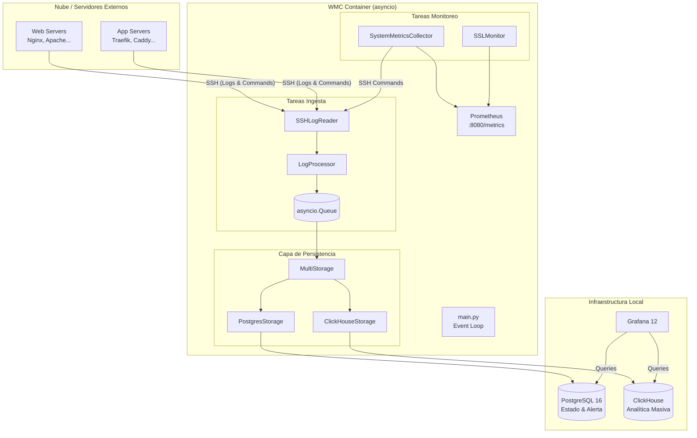
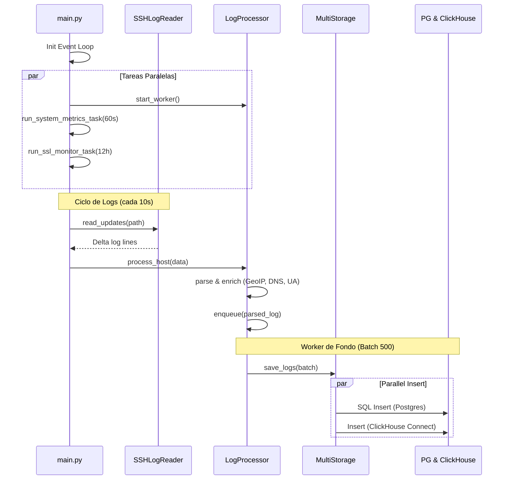

# 🏗️ Web Metrics Collector: Arquitectura del Sistema (V2)

Esta documentación proporciona una visión técnica detallada del **Web Metrics Collector (WMC)**, diseñada para desarrolladores que deseen entender, mantener o extender el sistema tras la expansión de rendimiento y seguridad.

---

## 📋 Tabla de Contenidos
1. [Arquitectura General](#arquitectura)
2. [Interacción de Componentes (Mermaid)](#interaccion)
3. [Flujo de Datos y Tareas de Fondo](#flujo-de-datos)
4. [Estrategia de Almacenamiento Dual](#almacenamiento)
5. [Componentes del Core (.py)](#componentes-del-core)
6. [Observabilidad y Métricas](#observabilidad)
7. [Tech Stack](#tech-stack)

---

## 1. Arquitectura General <a name="arquitectura"></a>

WMC utiliza una arquitectura **basada en eventos y asíncrona** implementada con `asyncio`. El sistema ahora opera en tres planos distintos:
1.  **Ingesta de Logs**: Alta frecuencia, desacoplada mediante colas.
2.  **Monitoreo de Salud (Telemetría)**: Baja frecuencia (60s), extrae vitales del sistema.
3.  **Vigilancia de Seguridad (SSL)**: Muy baja frecuencia (12h), valida certificados.

### Diagrama de Bloques Actualizado


---

## 2. Interacción de Componentes <a name="interaccion"></a>

El siguiente diagrama de secuencia describe cómo interactúan los componentes durante un ciclo típico de procesamiento.



---

## 3. Flujo de Datos y Tareas de Fondo <a name="flujo-de-datos"></a>

### Tareas de Fondo (Background Tasks)
1.  **Log Buffer Worker**: Consume la `asyncio.Queue` y realiza inserciones en batch. Aplica **Exponential Backoff** si ambos almacenes fallan.
2.  **System Metrics Task (60s)**: Ejecuta comandos `top`, `free` y `df` vía SSH para recolectar CPU, RAM y ocupación de disco.
3.  **SSL Monitor Task (12h)**: Realiza un handshake SSL contra los dominios configurados para obtener la fecha de expiración.
4.  **Retention Scheduler (24h)**: Ejecuta comandos de limpieza en PostgreSQL (`DELETE`) y ClickHouse (`ALTER TABLE DELETE`).

---

## 4. Estrategia de Almacenamiento Dual <a name="almacenamiento"></a>

WMC utiliza `storage.py` para implementar un patrón de **Multi-almacenamiento**, permitiendo que los datos fluyan a dos bases de datos con propósitos distintos:

### Comparativa de Esquemas y Tipos de Datos

| Campo | Postgres (Relacional) | ClickHouse (Analítico) | Razón |
| :--- | :--- | :--- | :--- |
| `client_ip` | `INET` | `IPv4` | Optimización de red en CH |
| `timestamp` | `TIMESTAMPTZ` | `DateTime64(3)` | Precisión de ms en CH |
| `status_code`| `SMALLINT` | `UInt16` | Ahorro de espacio |
| `is_fake_bot`| `BOOLEAN` | `UInt8` (0/1) | Compatibilidad CH |
| `source_host`| `VARCHAR` | `LowCardinality(String)` | Compresión por diccionario en CH |

**Filosofía**:
- **Postgres**: Actúa como fuente de verdad para el estado actual, IPs bloqueadas y filtros rápidos.
- **ClickHouse**: Actúa como el motor de analítica histórica pesada, optimizado para agregaciones (ej: "hits por país en el último año").

### Implementación del MultiStorage

El wrapper `MultiStorage` en `storage.py` utiliza `asyncio.gather` para realizar las inserciones en PostgreSQL y ClickHouse de forma paralela, maximizando el throughput:

```python
async def save_logs(self, logs):
    tasks = [self.primary.save_logs(logs)]
    if self.secondary:
        tasks.append(self.secondary.save_logs(logs))
    await asyncio.gather(*tasks)
```

**Nota sobre ClickHouse**: La conexión se realiza mediante `clickhouse-connect` (HTTP Driver). Debido a que es una librería mayoritariamente bloqueante, se utiliza `asyncio.to_thread` para no bloquear el event loop principal de WMC.

### Inicialización de Datos

El archivo `database/clickhouse_init.sql` define el esquema de la tabla `web_access_logs`. Es crucial que este script incluya `USE wmc_db;` para asegurar que las tablas se creen en el esquema correcto durante el primer arranque del contenedor.

---

## 5. Componentes del Core (.py) <a name="componentes-del-core"></a>

| Archivo | Responsabilidad Técnica |
| :--- | :--- |
| `main.py` | Orquestador central. Gestiona el ciclo de vida de todas las tareas `asyncio`. |
| `processor.py` | Coordina el enriquecimiento. Usa un buffer de 10k entradas para absorber picos. |
| `storage.py` | Implementa `PostgresStorage`, `ClickHouseStorage` y el wrapper `MultiStorage`. |
| `ssh_client.py` | Abstracción de red. Maneja reconexiones automáticas y ejecución de comandos remotos. |
| `system_metrics.py` | Parser de telemetría. Convierte salidas de shell de Linux en métricas Prometheus. |
| `ssl_monitor.py` | Monitor de seguridad. Realiza conexiones socket SSL para auditar certificados. |
| `parser.py` | Motor de expresiones regulares y JSON para 6 formatos de web server. |
| `geoip.py` | Interfaz asíncrona para la base de datos MaxMind GeoLite2. |
| `ua_enricher.py` | Clasificador de User-Agents (Diferencia bots de humanos). |

---

## 6. Observabilidad y Métricas <a name="observabilidad"></a>

WMC expone un endpoint Prometheus en el puerto **8080** con métricas clave:

- **Sistema**: `wmc_host_cpu_usage_percent`, `wmc_host_memory_usage_percent`, `wmc_host_disk_usage_percent`.
- **Seguridad**: `wmc_ssl_cert_days_remaining`.
- **Rendimiento**: `wmc_ingestion_latency_seconds` (Histograma).
- **Salud del Buffer**: `wmc_log_buffer_size`.

---

## 7. Tech Stack <a name="tech-stack"></a>

| Categoría | Tecnología |
| :--- | :--- |
| **Lenguaje** | Python 3.12 (Asíncrono) |
| **Bases de Datos** | PostgreSQL 16 & ClickHouse 24 |
| **Networking** | `asyncssh` & `asyncpg` & `clickhouse-connect` |
| **Geolocalización** | MaxMind GeoLite2 |
| **Visualización** | Grafana 12.0 |
| **Observabilidad** | Prometheus Client |
