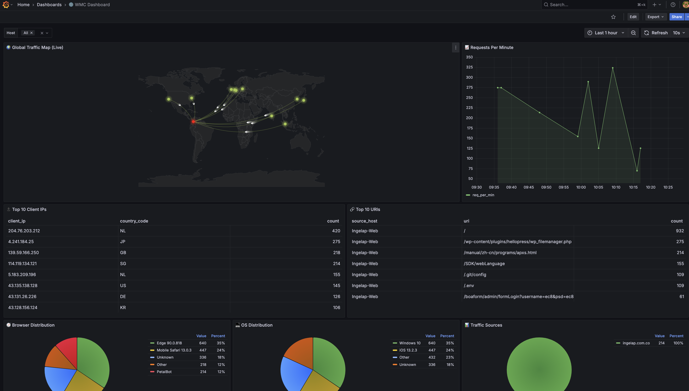

# 🌐 Web Metrics Collector (WMC)

[🇧🇷 Português](#web-metrics-collector-wmc-português)

WMC es un sistema centralizado de monitoreo de logs que visualiza el tráfico web geográficamente y por volumen. Se conecta a servidores remotos vía SSH, analiza los registros, los enriquece con datos GeoIP y los almacena en PostgreSQL para su visualización en Grafana.

[](https://github.com/grs89/Web_Metrics_Collector/actions/workflows/docker-publish.yml)
[](https://hub.docker.com/r/gersonofstone/web_metrics_collector)
[](https://hub.docker.com/r/gersonofstone/web_metrics_collector)
[](LICENSE)



## ✨ Características

### 📡 Recolección Multi-Servidor
- **Sin Agentes**: Usa SSH para leer logs (no requiere instalación en servidores remotos).
- **Formatos Soportados**: Nginx (JSON/CLF), Apache (Combined), IIS (W3C), **Traefik (JSON)**, **Caddy (JSON)**, **HAProxy**.

### 🛡️ Inteligencia de Seguridad
- **Detección de Hosts Sospechosos**: Identifica clones (Phishing), scanners y configuraciones DNS erróneas.
- **Detección de Falsos Googlebot**: Bloquea IPs que pretenden ser Googlebot mediante Reverse DNS.
- **Fail2Ban Lite**: Bloqueo automático de IPs con actividad maliciosa.
- **Clasificación de Bots**: Visualiza "Good Bots" (Google, Bing) vs "Bad Bots" (MJ12, Petal).

### 🔁 Resiliencia y Auto-Recuperación
- **Exponential Backoff (SSH)**: Si un servidor remoto no responde, reintenta automáticamente con esperas crecientes (1s → 2s → 4s → 8s → 16s).
- **Buffer en Memoria**: Los logs se almacenan en una cola interna (`asyncio.Queue`, 10.000 entradas) antes de guardarse. Si la base de datos falla temporalmente, los logs **no se pierden**.
### 📉 Inteligencia de Datos
- **Detección de Anomalías**: Identifica picos o caídas inusuales de tráfico comparando el tiempo real contra el promedio histórico (Z-Score).
- **Multisoporte de Logs**: Soporte para `access.log`, `error.log` (Nginx) y logs de aplicaciones (`Python`, `Node.js`, `PHP`).
- **Almacenamiento Dual**: Los logs se guardan simultáneamente en **PostgreSQL** (estado) y **ClickHouse** (analítica).

### 🔁 Resiliencia y Persistencia
- **Persistencia de Offsets**: Guarda la posición de lectura en un archivo de estado para no perder ni duplicar datos tras un reinicio.
- **Exponential Backoff**: Reintentos inteligentes para conexiones SSH y escrituras en base de datos.

### 📊 Observabilidad
- **Métricas Prometheus**: Endpoint en `:8082/metrics` con telemetría completa.
- **ClickHouse Analytics**: Motor optimizado para consultas agregadas sobre millones de registros.
- **Docker Health Check**: El contenedor se auto-monitorea. Si el event loop se bloquea, Docker lo detecta y puede reiniciarlo.

### 📈 Analítica y Visualización
- **Visualización**: Dos dashboards de Grafana preconfigurados:
  - **WMC Dashboard**: Mapa mundial, latencia, fuentes de tráfico y análisis de bots.
  - **🛡️ WMC Security Center**: Mapa de ataques, Top 10 IPs amenaza, ancho de banda bots vs usuarios reales.
- **Mapa de Tráfico Animado**: Visualización 3D en vivo del flujo de tráfico.
- **Panel de Latencia**: Tiempos de respuesta promedio por minuto.
- **Fuentes de Tráfico**: Desglose por referidos (Google, Directo, Redes Sociales).
- **Usuarios Activos**: Conteo en tiempo real por sitio (vHost).
- **Desglose Técnico**: Navegador, Sistema Operativo y Dispositivo.
- **DNS Inverso**: Resuelve IPs a nombres de host (con caché).
- **Retención de Datos**: Limpieza automática de registros con más de 1 año.

---

## 🚀 Inicio Rápido (Docker Compose Local)

1. **Prerrequisitos**: Docker y Docker Compose.
2. **Configurar Llaves SSH**: Coloca tus llaves SSH en la carpeta `keys/`.
3. **Configurar Hosts**: Edita `hosts.yml` para definir tus servidores.
   ```yaml
   hosts:
     - name: "mi-servidor-web"
       host: "1.2.3.4"
       user: "root"
       key_path: "/ssh_keys/id_rsa"
       log_files:
         - path: "/var/log/nginx/access.log"
           type: "nginx-json"
         # Otros tipos: nginx-combined, apache-combined, iis, traefik, caddy, haproxy
   ```
4. **Base de Datos GeoIP**: Coloca `GeoLite2-City.mmdb` en `log_processor/`.
5. **Ejecutar**:
   ```bash
   docker compose up -d --build
   ```
6. **Acceder a Grafana**: Abre `http://localhost:3000` (Usuario: `admin` / Contraseña: `admin`). Encontrarás dos dashboards:
   - **WMC Dashboard**: Analítica general de tráfico.
   - **🛡️ WMC Security Center**: Centro de mando de seguridad (mapa de ataques, Top 10 amenazas, ancho de banda bots vs usuarios reales).
7. **Ver Métricas Internas**: Abre `http://localhost:8082/metrics`.

### ⚙️ Configuración del Dashboard
Para que la detección de **Hosts Sospechosos** funcione:
1. En el dashboard, busca la caja de texto **"Trusted Domain"** en la parte superior.
2. Escribe tu dominio principal (ej: `misitio.com`).
3. El panel "🚨 Suspicious Hosts" mostrará solo el tráfico que **NO** coincide con tu dominio.

---

## ➕ Formatos de Log Soportados

| Tipo (`hosts.yml`) | Servidor | Formato |
| :--- | :--- | :--- |
| `nginx-json` | Nginx | JSON estructurado (recomendado, incluye latencia) |
| `nginx-combined` | Nginx | Combined Log Format estándar |
| `apache-combined` | Apache | Combined Log Format estándar |
| `iis` | Microsoft IIS | W3C Extended Log Format |
| `traefik` | Traefik | JSON estructurado |
| `caddy` | Caddy | JSON estructurado |
| `haproxy` | HAProxy | HTTP Log Format estándar |

---

## ➕ Incorporar un Nuevo Servidor

1. **Acceso SSH**: Asegúrate de tener acceso mediante llave pública SSH al servidor objetivo.
2. **Elige el formato** de la tabla de arriba y usa el `type` correspondiente en `hosts.yml`.
3. **Actualizar Configuración**: Agrega la entrada a `hosts.yml`.
4. **Reiniciar**:
   ```bash
   docker compose restart log-processor
   ```

---

## ☁️ Despliegue en Producción (Kubernetes)

Los manifiestos se encuentran en `k8s/`.
1. Actualiza `k8s/configmap.yaml` con tu `hosts.yml` real.
2. Crea los secretos para las llaves SSH.
3. Aplica:
   ```bash
   kubectl apply -k k8s/
   ```

---

# 🌐 Web Metrics Collector (WMC) - Português

[🇪🇸 Español](#web-metrics-collector-wmc)

O WMC é um sistema centralizado de monitoramento de logs que visualiza o tráfego da web geograficamente e por volume. Conecta-se a servidores remotos via SSH, analisa os logs, enriquece-os com dados GeoIP e os armazena no PostgreSQL para visualização no Grafana.


## ✨ Funcionalidades

### 📡 Coleta Multi-Servidor
- **Sem Agentes**: Usa SSH para ler logs (sem instalação necessária em servidores remotos).
- **Formatos Suportados**: Nginx (JSON/CLF), Apache (Combined), IIS (W3C), **Traefik (JSON)**, **Caddy (JSON)**, **HAProxy**.

### 🛡️ Inteligência de Segurança
- **Detecção de Hosts Suspeitos**: Identifica clones (Phishing), scanners e configurações de DNS incorretas.
- **Detecção de Falso Googlebot**: Bloqueia IPs fingindo ser o Googlebot via Reverse DNS.
- **Fail2Ban Lite**: Banimento automático de IPs com atividade maliciosa.
- **Classificação de Bots**: Visualiza "Good Bots" (Google, Bing) vs "Bad Bots" (MJ12, Petal).

### 🔁 Resiliência e Auto-Recuperação
- **Exponential Backoff (SSH)**: Se um servidor remoto não responder, tenta novamente com esperas crescentes (1s → 2s → 4s → 8s → 16s).
- **Buffer em Memória**: Os logs são armazenados numa fila interna (`asyncio.Queue`, 10.000 entradas) antes de serem salvos. Se o banco de dados falhar temporariamente, os logs **não são perdidos**.
- **Retry no DB**: O worker de armazenamento tenta novamente com Exponential Backoff se o PostgreSQL ou ClickHouse não estiverem disponíveis.

### 📉 Inteligência de Dados
- **Detecção de Anomalias**: Identifica picos ou quedas inusitais de tráfego comparando o tempo real com a média histórica (Z-Score).
- **Armazenamento Dual**: Os logs são salvos simultaneamente no **PostgreSQL** (estado) e **ClickHouse** (análise massiva). Se um armazenamento falhar, o outro continua operando.

### 📊 Observabilidade
- **Métricas Prometheus**: Endpoint em `:8082/metrics` com telemetria completa.
- **ClickHouse Analytics**: Motor otimizado para consultas agregadas sobre milhões de registros.
- **Docker Health Check**: O container se auto-monitora. Se o event loop travar, o Docker detecta e pode reiniciá-lo.

### 📈 Análise e Visualização
- **Mapa de Tráfego Animado**: Visualização 3D ao vivo do fluxo de tráfego.
- **Painel de Latência**: Tempos de resposta médios por minuto.
- **Fontes de Tráfego**: Detalhamento por referências (Google, Direto, Redes Sociais).
- **Usuários Ativos**: Contagem em tempo real por site (vHost).
- **DNS Reverso**: Resolve IPs para nomes de host (com cache).
- **Retenção de Dados**: Limpeza automática de logs com mais de 1 ano.

---

## 🚀 Início Rápido (Docker Compose Local)

1. **Pré-requisitos**: Docker e Docker Compose.
2. **Configurar Chaves SSH**: Coloque suas chaves SSH na pasta `keys/`.
3. **Configurar Hosts**: Edite `hosts.yml` para definir seus servidores.
   ```yaml
   hosts:
     - name: "meu-servidor-web"
       host: "1.2.3.4"
       user: "root"
       key_path: "/ssh_keys/id_rsa"
       log_files:
         - path: "/var/log/nginx/access.log"
           type: "nginx-json"
   ```
4. **Banco de Dados GeoIP**: Coloque `GeoLite2-City.mmdb` em `log_processor/`.
5. **Executar**:
   ```bash
   docker compose up -d --build
   ```
6. **Acessar o Grafana**: Abra `http://localhost:3000` (Usuário: `admin` / Senha: `admin`). Você encontrará dois dashboards:
   - **WMC Dashboard**: Análise geral de tráfego.
   - **🛡️ WMC Security Center**: Centro de comando de segurança (mapa de ataques, Top 10 ameaças, largura de banda).
7. **Ver Métricas Internas**: Abra `http://localhost:8082/metrics`.

### ⚙️ Configuração do Dashboard
Para que a detecção de **Hosts Suspeitos** funcione:
1. No dashboard, encontre a caixa de texto **"Trusted Domain"** no topo.
2. Digite seu domínio principal (ex: `meusite.com`).
3. O painel "🚨 Suspicious Hosts" mostrará apenas o tráfego que **NÃO** coincide com seu domínio.

---

## ➕ Adicionando um Novo Servidor

1. **Acesso SSH**: Garanta acesso via chave pública SSH ao servidor de destino.
2. **Escolha o formato** da tabela de formatos e use o `type` correspondente no `hosts.yml`.
3. **Atualizar Configuração**: Adicione a entrada ao `hosts.yml`.
4. **Reiniciar**:
   ```bash
   docker compose restart log-processor
   ```

---

## ☁️ Implantação em Produção (Kubernetes)

Os manifestos estão em `k8s/`.
1. Atualize `k8s/configmap.yaml` com seu `hosts.yml` real.
2. Crie os segredos para as chaves SSH.
3. Aplique:
   ```bash
   kubectl apply -k k8s/
   ```
